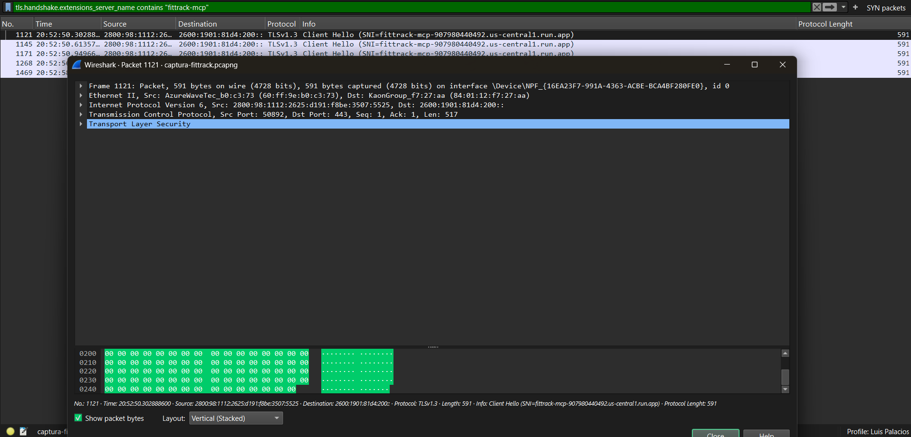
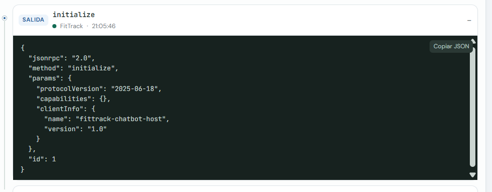

# Reporte — Proyecto 1: Uso de un Protocolo Existente (MCP)

**Universidad del Valle de Guatemala**  
**CC3067 Redes**  
**Autor:** Luis Palacios — Carnet 23933  
**Fecha:** 8 de septiembre de 2026

---

## 1. Introducción

### 1.1 Contexto

El **Model Context Protocol (MCP)** es un estándar abierto (Anthropic, 2024) que permite a los LLMs interactuar con herramientas externas mediante **JSON-RPC 2.0**. Resuelve el problema de interoperabilidad: una herramienta se implementa una vez y cualquier host compatible puede usarla.

### 1.2 Actores MCP

| Actor | Rol en este proyecto |
|-------|---------------------|
| **Servidor** | Ejecuta acciones (FitTrack local/remoto, Filesystem, Git) |
| **Cliente** | Mantiene conexión y traduce llamadas (capa en el chatbot) |
| **Anfitrión (Host)** | Aplicación que coordina clientes + LLM (chatbot web) |

### 1.3 Caso de uso industrial

**FitTrack** simula una app de fitness/nutrición (tipo MyFitnessPal): perfiles, macros, rutinas, registro de comidas/entrenos y sincronización de actividad de wearables.

---

## 2. Especificación del servidor MCP local

### 2.1 Transporte

- **Protocolo:** JSON-RPC 2.0, newline-delimited
- **Canal:** stdin/stdout (stdio)
- **Archivo:** `fittrack-mcp/server/fittrack_server.py`

### 2.2 Métodos JSON-RPC soportados

| Método | Tipo | Descripción |
|--------|------|-------------|
| `initialize` | Request/Response | Handshake, negociación de versión |
| `notifications/initialized` | Notification | Cliente listo (sin respuesta) |
| `tools/list` | Request/Response | Lista herramientas + JSON Schema |
| `tools/call` | Request/Response | Ejecuta una herramienta |
| `ping` | Request/Response | Liveness check |

### 2.3 Herramientas (tools)

| Tool | Parámetros requeridos | Descripción |
|------|----------------------|-------------|
| `crear_perfil` | usuario, peso_kg, altura_cm, edad, sexo, nivel_actividad, objetivo | Crea/actualiza perfil |
| `calcular_meta_nutricional` | usuario | Calorías y macros (Mifflin-St Jeor) |
| `generar_rutina` | usuario, dias_por_semana | Rutina semanal por nivel |
| `registrar_comida` | usuario, alimento, cantidad_g, calorias | Log de comida |
| `registrar_entrenamiento` | usuario | Marca entrenamiento completado |
| `sincronizar_actividad` | usuario, pasos, calorias_activas | Simula sync de wearable |
| `consultar_progreso` | usuario | Resumen del día/rango |

### 2.4 Almacenamiento

- Archivo JSON: `fittrack-mcp/data/fittrack_data.json`
- Sin base de datos externa

---

## 3. Especificación del servidor MCP remoto

### 3.1 Transporte

- **Protocolo:** JSON-RPC 2.0 sobre HTTP POST
- **Endpoint:** `POST /mcp`
- **Health check:** `GET /health`
- **Archivo:** `fittrack-remote/http_server.py`
- **Despliegue:** Google Cloud Run

### 3.2 URL del servicio

```
https://fittrack-mcp-907980440492.us-central1.run.app
```

**URL del chatbot (Cloud Run):** https://fittrack-chatbot-907980440492.us-central1.run.app

Accesible desde cualquier navegador con internet. FitTrack usa el servidor remoto en la misma nube.

### 3.3 Herramientas

Idénticas al servidor local (misma lógica en `tools.py` compartido).

### 3.4 Ejemplo de request

```http
POST /mcp HTTP/1.1
Content-Type: application/json

{"jsonrpc":"2.0","id":1,"method":"tools/call","params":{"name":"crear_perfil","arguments":{"usuario":"ana","peso_kg":65,"altura_cm":165,"edad":30,"sexo":"F","nivel_actividad":"ligero","objetivo":"mantener"}}}
```

---

## 4. Chatbot host (anfitrión web)

### 4.1 Componentes

| Componente | Archivo | Función |
|------------|---------|---------|
| API web | `chatbot/app.py` | FastAPI, sesiones, orquestación |
| Cliente MCP | `chatbot/mcp_client.py` | JSON-RPC manual (stdio + HTTP) |
| Manager | `chatbot/mcp_manager.py` | Gestiona FitTrack, Filesystem, Git |
| LLM | `chatbot/deepseek_client.py` | DeepSeek API (OpenAI-compatible) |
| UI | `chatbot/static/` | Chat + panel de log MCP |

### 4.2 Funcionalidades de rúbrica

| Requisito | Implementación |
|-----------|----------------|
| Conexión LLM vía API | DeepSeek `deepseek-chat` |
| Contexto en sesión | Historial `messages[]` por sesión |
| Log interacciones MCP | Panel lateral con timestamp, servidor, dirección, JSON |
| Filesystem MCP oficial | `@modelcontextprotocol/server-filesystem` |
| Git MCP oficial | `mcp-server-git` (Python, Anthropic official) |
| Servidor propio local | FitTrack stdio |
| Servidor propio remoto | FitTrack HTTP en Cloud Run |

### 4.3 Demo Git (Filesystem + Git)

Prompt: crear repo, README.md, add y commit "Initial commit" — botón **Run Git Demo** en la UI.

---

## 5. Análisis Wireshark

### 5.1 Configuración de captura

- **Interfaz usada:** Wi-Fi
- **Archivo guardado:** `captura-fittrack.pcapng`
- **Filtro aplicado:** `tls.handshake.extensions_server_name contains "fittrack-mcp"`
- **URL remota capturada:** `https://fittrack-mcp-907980440492.us-central1.run.app`
- **Escenario:** Chatbot host local (`localhost:8000`) en modo **Remoto**, enviando mensaje que invoca tools de FitTrack hacia Cloud Run.

Se capturaron **5 paquetes** filtrados, todos con **TLS Client Hello**, correspondientes al inicio de conexiones HTTPS hacia el servidor MCP remoto. Cada llamada HTTP al endpoint `/mcp` puede abrir una nueva conexión TLS.

> **Nota:** El payload JSON-RPC viaja cifrado dentro de TLS, por lo que no es legible directamente en Wireshark. El contenido de los mensajes MCP se documenta con el **Registro MCP** del chatbot (capa de aplicación).

### 5.2 Clasificación de mensajes JSON-RPC

Clasificación basada en el **Registro MCP** del panel del chatbot durante la misma sesión de captura:

| # | Tipo | Método | Dirección | Observación |
|---|------|--------|-----------|-------------|
| 1 | Sync | `initialize` | OUT → servidor | Handshake MCP, negociación de protocolo |
| 2 | Sync | `initialize` | IN ← servidor | Respuesta con `protocolVersion` y `serverInfo` |
| 3 | Sync | `notifications/initialized` | OUT → servidor | Cliente confirma inicialización (sin respuesta) |
| 4 | Request | `tools/list` | OUT → servidor | Solicitud de herramientas disponibles |
| 5 | Response | `tools/list` | IN ← servidor | Lista de 7 tools con `inputSchema` |
| 6 | Request | `tools/call` | OUT → servidor | Invocación de tool (ej. `crear_perfil`) |
| 7 | Response | `tools/call` | IN ← servidor | Resultado en `result.content[].text` |

**Criterio de clasificación:**
- **Sync:** `initialize`, `notifications/initialized`
- **Request:** mensaje con `"method"` e `"id"` enviado por el cliente
- **Response:** mensaje con `"result"` o `"error"` y el mismo `"id"`

### 5.3 Screenshots

**Wireshark — TLS Client Hello hacia fittrack-mcp (Cloud Run):**



**Registro MCP del chatbot — mensaje JSON-RPC (tools/call):**



---

## 6. Análisis por capas OSI/TCP-IP

### 6.1 Capa de Enlace (Data Link)

En Wireshark se observan tramas **Ethernet** o **802.11 (Wi-Fi)**. Cada paquete incluye direcciones **MAC** de origen (adaptador de red de la PC) y destino (router/AP). Esta capa se encarga de la transmisión física en la red local.

### 6.2 Capa de Red (IP)

Al expandir un paquete se ve **Internet Protocol Version 4 (IPv4)**. La IP de origen corresponde a la red local del host; la IP de destino es una dirección pública de **Google Cloud** (infraestructura de Cloud Run). El protocolo IP enruta los paquetes entre la PC del cliente y el servidor remoto en Internet.

### 6.3 Capa de Transporte (TCP)

El tráfico hacia Cloud Run usa **TCP puerto 443** (HTTPS). En la captura se identifican paquetes **TLS Client Hello**, que inician el handshake TLS sobre TCP. TCP garantiza la entrega ordenada y confiable de los segmentos entre cliente y servidor.

### 6.4 Capa de Aplicación (HTTP + JSON-RPC)

En la capa de aplicación, el servidor remoto expone **`POST /mcp`** con cuerpo **JSON-RPC 2.0**. Ejemplo de estructura (visible en el Registro MCP, no en Wireshark por cifrado TLS):

```json
{"jsonrpc":"2.0","id":1,"method":"tools/call","params":{"name":"crear_perfil","arguments":{...}}}
```

La respuesta incluye `"result"` con el contenido de la herramienta. Wireshark muestra **TLS Application Data** cifrado; el Registro MCP del chatbot complementa el análisis mostrando el JSON-RPC en texto plano antes/después de la capa TLS.

---

## 7. Dificultades encontradas

1. **JSON-RPC manual:** Implementar el protocolo sin SDK requirió cuidar que `stdout` solo llevara mensajes del protocolo y que los logs fueran a `stderr`.
2. **Stdio vs HTTP:** El servidor local usa newline-delimited JSON por stdin/stdout; el remoto usa HTTP POST al mismo formato JSON-RPC.
3. **TLS y Wireshark:** El contenido JSON-RPC no es visible en Wireshark por HTTPS; se resolvió documentando capas inferiores en Wireshark y JSON-RPC en el log del host.
4. **Servidor Git MCP:** Requería `git init` en el repositorio demo y usar `mcp-server-git` (Python) en lugar del paquete npm inexistente.
5. **Despliegue en Cloud Run:** Configurar variables de entorno (`DEEPSEEK_API_KEY`, `FITTRACK_REMOTE_URL`) y memoria suficiente (1 GiB) para los subprocess MCP.

---

## 8. Conclusiones

Este proyecto permitió comprender el **Model Context Protocol** como estándar abierto para conectar LLMs con herramientas externas mediante **JSON-RPC 2.0**. Los tres actores — servidor, cliente y anfitrión — quedaron claros al implementar FitTrack como servidor propio y un chatbot web como host que orquesta múltiples servidores MCP (FitTrack, Filesystem y Git).

La implementación manual del protocolo reforzó cómo funcionan el handshake (`initialize`), las notificaciones, `tools/list` y `tools/call`. El despliegue remoto en **Google Cloud Run** demostró que el mismo servidor puede ejecutarse localmente (stdio) o en la nube (HTTP), accesible desde cualquier red.

El análisis con **Wireshark** mostró las capas de enlace, red, transporte y TLS en tráfico real hacia Cloud Run, mientras que el Registro MCP permitió clasificar los mensajes de sincronización, petición y respuesta a nivel de aplicación. En conjunto, el proyecto cumple el objetivo de comprender un protocolo de aplicación existente (MCP/JSON-RPC) en un caso de uso de industria (fitness/nutrición).

---

## 9. Referencias

- JSON-RPC: https://www.jsonrpc.org/
- MCP Architecture: https://modelcontextprotocol.io/docs/learn/architecture
- MCP Specification: https://modelcontextprotocol.io/specification/2025-11-25
- MCP Servers: https://github.com/modelcontextprotocol/servers
- Repositorio: https://github.com/Luisfer2211/MCP_Redes
